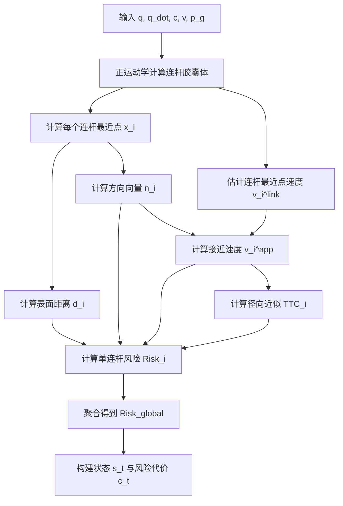

# 面向单动态障碍物的机械臂连杆级风险约束 SAC 避障方法研究

## 目录

- [面向单动态障碍物的机械臂连杆级风险约束 SAC 避障方法研究](#面向单动态障碍物的机械臂连杆级风险约束-sac-避障方法研究)
  - [目录](#目录)
  - [一、研究背景与意义](#一研究背景与意义)
  - [二、研究目标](#二研究目标)
  - [三、拟创新点](#三拟创新点)
  - [四、研究范围与关键问题](#四研究范围与关键问题)
    - [4.1 研究范围](#41-研究范围)
    - [4.2 拟解决的关键问题](#42-拟解决的关键问题)
  - [五、文献综述与总体技术路线](#五文献综述与总体技术路线)
    - [5.1 文献综述安排](#51-文献综述安排)
    - [5.2 总体技术路线](#52-总体技术路线)
  - [六、主要研究内容](#六主要研究内容)
    - [6.1 机械臂整臂几何建模](#61-机械臂整臂几何建模)
    - [6.2 单动态障碍物与任务目标建模](#62-单动态障碍物与任务目标建模)
    - [6.3 连杆级动态风险表征方法](#63-连杆级动态风险表征方法)
    - [6.4 约束强化学习问题建模](#64-约束强化学习问题建模)
    - [6.5 状态空间设计](#65-状态空间设计)
    - [6.6 动作空间设计](#66-动作空间设计)
    - [6.7 任务奖励函数设计](#67-任务奖励函数设计)
    - [6.8 连杆级动态风险代价函数设计](#68-连杆级动态风险代价函数设计)
    - [6.9 连杆级动态风险约束 SAC 方法](#69-连杆级动态风险约束-sac-方法)
    - [6.10 风险自适应动作平滑执行机制](#610-风险自适应动作平滑执行机制)
    - [6.11 算法训练流程](#611-算法训练流程)
  - [七、实验设计](#七实验设计)
    - [7.1 仿真实验平台](#71-仿真实验平台)
    - [7.2 真实环境实验平台](#72-真实环境实验平台)
    - [7.3 四个实验方法](#73-四个实验方法)
    - [7.4 评价指标](#74-评价指标)
    - [7.5 仿真实验一：基础目标到达能力验证](#75-仿真实验一基础目标到达能力验证)
    - [7.6 仿真实验二：单动态障碍物整臂避障对比实验](#76-仿真实验二单动态障碍物整臂避障对比实验)
    - [7.7 仿真实验三：风险约束 SAC 机制分析](#77-仿真实验三风险约束-sac-机制分析)
    - [7.8 仿真实验四：风险自适应平滑机制分析](#78-仿真实验四风险自适应平滑机制分析)
    - [7.9 真实环境低速整臂避障验证](#79-真实环境低速整臂避障验证)
    - [7.10 参数敏感性与失败案例分析](#710-参数敏感性与失败案例分析)
    - [7.11 实验可靠性设置](#711-实验可靠性设置)
## 一、研究背景与意义

随着机械臂在智能制造、人机协作、服务机器人和复杂作业环境中的应用不断增加，其工作环境逐渐由结构化、静态环境向非结构化、动态环境转变。在动态环境中，机械臂不仅需要完成末端静态目标位置到达任务，还需要在运动过程中避免与外部动态障碍物发生碰撞。

传统机械臂避障方法常以末端执行器为主要避障对象，或者使用机械臂与障碍物之间的全局最小距离作为风险依据。然而，机械臂的碰撞风险并不只发生在末端执行器，也可能发生在肩部、上臂、肘部、前臂、腕部等非末端连杆区域。当动态障碍物从机械臂侧向穿越或靠近肘部、前臂等区域时，仅关注末端执行器可能无法及时反映整臂碰撞风险。

此外，动态避障风险不仅由当前几何距离决定，还与障碍物相对于机械臂连杆的空间方向、接近速度以及短时碰撞趋势有关。某些障碍物虽然当前距离较远，但如果正在快速接近某一连杆，仍可能在短时间内形成较高碰撞风险。因此，机械臂动态避障控制需要综合考虑距离、方向、相对运动趋势和时间风险特征。

强化学习方法具有较强的非线性决策能力，适合处理复杂连续控制问题。Soft Actor-Critic，简称 SAC，具有较好的样本效率和训练稳定性，适合用于机械臂关节速度控制任务。但传统 SAC 避障方法通常将风险作为固定惩罚项加入奖励函数，风险惩罚权重需要人工设定。如果风险权重过小，策略可能忽视安全；如果风险权重过大，策略可能过于保守，影响目标到达效率。

为降低固定风险惩罚权重对任务与安全权衡的影响，本文将机械臂动态避障问题建模为带安全代价约束的强化学习问题，并以连杆级动态风险代价和拉格朗日乘子刻画安全约束，在训练阶段自适应调节策略的安全强度。

同时，强化学习策略直接输出关节速度时容易出现动作抖动，而固定低通滤波又可能削弱高风险阶段的避障响应。为此，本文将动作平滑限定为执行层补充模块，用于改善部署阶段的平滑性与响应性。

本文主线压缩为“连杆级动态风险建模 - 约束 SAC 学习 - 风险自适应执行与验证”。本文以固定基座 UR5 机械臂在单动态球形障碍物环境下的静态目标位置到达任务为研究对象，将机械臂主要连杆纳入风险评估范围，将连杆级动态风险作为安全代价引入约束 SAC 框架，并将动作平滑限定为执行层补充模块。本文不宣称提供严格形式化安全保证，而是通过仿真实验和低速真实环境实验验证方法在降低碰撞率、减少安全距离违反、保持目标到达能力和改善运动平滑性方面的有效性。

本文围绕一个核心问题展开：**连杆级动态风险约束是否能够提升机械臂在动态障碍物靠近非末端连杆时的整臂避障能力**。具体创新点在第三节单独说明，实验结论将依据消融结果审慎归因，避免将完整系统性能提升简单归因于单一模块。

## 二、研究目标

本文面向固定基座 UR5 机械臂在单动态障碍物环境下的静态目标位置到达与整臂避障控制问题，主线概括为：连杆级动态风险建模、约束 SAC 学习、执行层补充与验证。

1. 构建 UR5 整臂几何模型与连杆级动态风险模型，统一描述距离、方向、接近速度和径向近似 TTC，并形成可用于学习与评价的风险代价。
2. 将静态目标到达与动态避障建模为 CMDP，提出连杆级动态风险约束 SAC，并通过拉格朗日乘子自适应调节安全约束强度。
3. 设计风险自适应动作平滑执行机制，并搭建 PyBullet 仿真与 UR5 低速真实验证平台，通过碰撞率、最小距离、安全距离违反率、目标到达误差、关节加速度和 jerk 等指标完成消融验证。

具体研究目标如下：

- 构建机械臂整臂几何风险模型，将肩部、上臂、前臂、腕部等主要连杆纳入风险评估范围，避免仅关注末端执行器导致的非末端连杆风险遗漏问题。
- 建立连杆级动态风险表征方法，综合考虑连杆与单动态障碍物之间的距离、方向、接近速度和径向近似 TTC，形成可供强化学习策略使用的整臂风险状态，并明确风险状态、风险代价和评价指标之间的边界。
- 将机械臂静态目标到达与动态避障问题建模为带安全代价约束的强化学习问题，提出连杆级动态风险约束 SAC 方法，以 episode 平均风险代价作为主要约束口径，并通过拉格朗日乘子在训练阶段自适应调节风险约束强度。
- 设计风险自适应动作平滑执行机制，根据整臂全局风险动态调整关节速度滤波系数，在低风险时提高运动平滑性，在高风险时提高避障响应速度，并将其定位为执行层增强模块。
- 搭建 PyBullet 仿真实验平台和基于 RGB-D 相机的低速真实环境验证系统，通过碰撞率、最小距离、安全距离违反率、目标到达误差、关节加速度和 jerk 等指标验证方法在本文设定场景下的改进效果；在仿真实验中增加最小消融对比，以区分连杆级风险、风险约束 SAC 和自适应平滑模块的贡献。

## 三、拟创新点

本文创新点按“核心创新、支撑创新、工程增强”分层组织，避免将完整系统的性能提升简单归因于多个模块叠加。

1. **核心创新：连杆级动态风险约束 SAC 方法。** 面向单动态障碍物靠近非末端连杆的场景，本文将距离、方向、接近速度和径向近似 TTC 构成的连杆级风险代价引入 CMDP，并在 SAC 中采用风险代价 critic 与拉格朗日乘子更新机制，使任务奖励与安全代价分离，降低固定风险奖励惩罚权重对训练结果的敏感性。
2. **支撑创新：连杆级动态风险表征。** 相比仅使用末端风险或整臂全局最小距离，本文保留各主要连杆的局部风险信息，使策略能够识别风险发生部位，并对上臂、肘部、前臂和腕部等非末端区域形成更有针对性的避障动作。
3. **工程增强：风险自适应动作平滑执行机制。** 该机制不作为本文主要理论创新，而作为部署阶段的执行层补充模块，用于在低风险阶段降低动作抖动，在高风险阶段减少固定平滑带来的响应滞后。

因此，本文主要贡献归因于“连杆级动态风险约束学习”本身；风险自适应平滑只在消融实验中作为辅助机制单独讨论。

## 四、研究范围与关键问题

### 4.1 研究范围

为保证研究内容聚焦、实验工作量可控，本文研究范围限定如下：

- **研究对象**：本文以固定基座 UR5 机械臂为研究对象，重点研究机械臂主要连杆在运动过程中的外部动态避障问题。自碰撞、移动基座控制和末端姿态精确控制不作为本文重点。

- **任务场景**：本文研究静态目标位置到达任务，即机械臂末端从初始位姿运动到给定静态目标点，同时在运动过程中避开外部动态障碍物。本文不研究动态目标跟踪问题。

- **障碍物设定**：本文以单个动态球形障碍物为研究对象。仿真中障碍物按照预设轨迹或随机轨迹运动，真实实验中采用轻质球体或泡沫球作为障碍物，由人工低速移动。本文不研究多障碍物、非规则障碍物和复杂遮挡条件下的感知问题。

- **方法边界**：本文重点研究连杆级动态风险表征与代价建模、风险约束 SAC 控制和风险自适应动作平滑执行方法。其中，连杆级动态风险约束 SAC 是本文的核心方法，风险自适应动作平滑属于执行层增强模块。本文不提供严格安全性理论证明，不研究控制屏障函数、模型预测控制等形式化安全控制方法。

- **实验边界**：本文以 PyBullet 仿真实验为主要验证手段，真实环境实验仅用于验证方法在 UR5 平台上的基本可执行性和低速避障响应能力。真实实验不进行在线强化学习训练，不进行高风险碰撞性对比实验。

### 4.2 拟解决的关键问题

本文拟重点解决以下关键问题：

- **整臂避障风险如何建模**：传统末端避障难以反映上臂、肘部、前臂等非末端连杆的碰撞风险。本文需要建立面向机械臂主要连杆的几何风险模型，使强化学习策略能够感知整臂不同部位与动态障碍物之间的风险关系。

- **连杆级动态风险如何表征并转化为代价**：单纯依赖最小距离难以描述动态障碍物的短时碰撞趋势。本文需要综合距离、方向、接近速度和径向近似 TTC 等因素，构建能够反映动态接近趋势的连杆级风险状态，并进一步明确风险状态、风险代价和实验评价指标的不同用途，避免概念混用。

- **风险约束如何融入 SAC 训练过程**：传统 SAC 通常通过固定奖励惩罚处理避障风险，容易受到人工权重设置影响。本文需要将连杆级动态风险转化为安全代价，并通过拉格朗日乘子自适应调节风险约束强度，以平衡目标到达效率和整臂避障安全性。

- **如何兼顾动作平滑性与高风险响应能力**：强化学习策略直接输出关节速度时容易产生动作抖动，而固定平滑滤波可能导致高风险状态下避障响应滞后。本文需要设计风险自适应动作平滑机制，使机械臂在低风险状态下运动平稳，在高风险状态下保持足够响应速度。

- **如何通过有限实验验证改进效果**：本文需要在可控实验范围内设计有针对性的仿真和真实低速验证实验，通过碰撞率、最小距离、安全距离违反率、目标到达误差、关节加速度和 jerk 等指标，评价本文方法相对于对比方法的安全性、任务完成能力和运动平滑性。

## 五、文献综述与总体技术路线

### 5.1 文献综述安排

为支撑本文选题和创新点论证，论文文献综述拟围绕以下方向展开：

- 机械臂避障方法研究，包括人工势场法、采样规划、优化控制、MPC 和 CBF 等方法，重点分析其在动态环境、整臂避障和实时性方面的特点。
- 机械臂整臂碰撞风险建模研究，包括末端避障、连杆级避障、胶囊体近似、距离场和最近点距离计算等方法，重点说明仅使用末端风险或全局最小距离的局限。
- 强化学习机械臂避障研究，包括 DDPG、TD3、SAC 等连续控制算法在机械臂避障中的应用，重点分析固定奖励惩罚权重带来的安全与任务权衡问题。
- 约束强化学习与安全强化学习研究，包括 CMDP、拉格朗日约束优化和安全代价 critic 等方法，重点说明本文采用约束 SAC 的依据。
- 动作平滑与策略部署研究，包括低通滤波、动作变化惩罚和执行层安全滤波等方法，重点说明固定平滑与高风险快速响应之间的矛盾。
- 文献缺口与本文定位，重点回答“现有方法在单动态障碍物场景下为什么不足”“本文的核心改进究竟是什么”“哪些部分只是工程增强而非主要创新”。

| 现有做法 | 主要局限 | 本文对应改进 |
| --- | --- | --- |
| 末端风险或全局最小距离 | 难以反映非末端连杆的局部碰撞风险 | 连杆级动态风险表征 |
| 固定风险惩罚 SAC | 风险权重对结果敏感，安全与效率难平衡 | 连杆级动态风险约束 SAC |
| 固定低通滤波 | 平滑性与高风险响应能力难以兼顾 | 风险自适应动作平滑 |

文献综述将服务于本文主线：连杆级动态风险建模、约束 SAC 学习与执行层补充能否比末端风险和固定惩罚方法更有效地提升动态障碍物场景下的整臂避障能力。

### 5.2 总体技术路线

本文总体技术路线如下：

| 阶段 | 主要步骤 |
| --- | --- |
| 建模阶段 | 1. 机械臂整臂几何建模<br>2. 动态障碍物建模<br>3. 连杆-障碍物最近点与距离计算 |
| 风险表征阶段 | 4. 连杆自身对应点速度估计<br>5. 连杆级方向、接近速度和径向近似 TTC 计算<br>6. 连杆级动态风险表征构建 |
| 强化学习阶段 | 7. 构建风险代价函数<br>8. 建立约束强化学习问题<br>9. 连杆级动态风险约束 SAC 策略学习 |
| 执行控制阶段 | 10. SAC 输出期望关节速度<br>11. 风险自适应动作平滑<br>12. 执行关节速度控制 |
| 验证阶段 | 13. 仿真实验与 RGB-D 真实环境低速验证 |

系统输入包括：

| 类别 | 符号 | 含义 |
| --- | --- | --- |
| 机械臂状态 | q | 机械臂关节角。 |
| 机械臂状态 | q_dot | 机械臂关节速度。 |
| 任务目标 | p_g | 末端任务目标位置。 |
| 任务目标 | v_g | 目标速度，静态目标时取零。 |
| 障碍物状态 | c | 障碍物中心位置。 |
| 障碍物状态 | v | 障碍物速度。 |
| 执行记忆 | q_dot_cmd(t-1) | 上一时刻实际执行关节速度。 |
| 执行记忆 | beta(t-1) | 上一时刻平滑系数。 |

系统输出为：**机械臂关节速度控制指令 q_dot_cmd(t)**

整体控制流程如下：

1. 获取机械臂状态、目标状态和障碍物状态。
2. 根据正运动学计算机械臂主要连杆胶囊体模型。
3. 计算每个连杆与障碍物之间的最近点和表面距离。
4. 计算障碍物相对于连杆最近点的方向向量。
5. 估计连杆自身对应点速度，并计算障碍物相对于连杆的接近速度。
6. 计算径向近似 TTC，构建连杆级动态风险向量。
7. 构建风险代价 `c_t`，将状态输入风险约束 SAC 策略网络。
8. 策略输出期望关节速度，经风险自适应平滑模块得到实际执行速度。
9. 执行关节速度控制，并根据任务奖励和风险代价更新策略。

训练阶段与部署阶段的区别如下：

| 阶段 | 是否更新策略 | 主要更新对象 | lambda 作用 | beta 作用 | 真实部署说明 |
| --- | --- | --- | --- | --- | --- |
| 训练阶段 | 是 | 策略网络、奖励 critic、风险代价 critic、温度参数 alpha、拉格朗日乘子 lambda | 根据风险代价水平调节策略优化中的安全约束强度 | 根据 Risk_global 实时调整动作平滑程度 | 在 PyBullet 中完成强化学习训练。 |
| 测试阶段 | 否 | 不更新网络参数 | 固定为训练结束后的取值 | 根据 Risk_global 实时计算 | 用于仿真测试和泛化评估。 |
| 真实部署阶段 | 否 | 不进行在线强化学习训练 | 不作为实时避障调节器 | 根据 Risk_global 实时计算 | 仅做低速可执行性和基本避障响应验证。 |

## 六、主要研究内容

### 6.1 机械臂整臂几何建模

本文以 UR5 机械臂为研究对象，将机械臂主要连杆纳入风险评估范围。相比仅考虑末端执行器的避障方式，整臂建模能够更好地描述肩部、上臂、肘部、前臂和腕部等区域的潜在碰撞风险。

本文采用胶囊体模型近似表示机械臂主要连杆。胶囊体由一条空间线段和一个半径组成，能够在计算效率和几何近似精度之间取得较好平衡，适合用于强化学习环境中的高频风险计算。

第 i 个连杆表示为：

L_i = {p_i^a(q), p_i^b(q), r_i}

其中：

| 符号 | 含义 |
| --- | --- |
| p_i^a(q) | 第 i 个连杆胶囊体起点。 |
| p_i^b(q) | 第 i 个连杆胶囊体终点。 |
| r_i | 第 i 个连杆胶囊体半径。 |
| q | 机械臂关节角。 |

连杆端点由机械臂正运动学计算得到：`p_i^a(q), p_i^b(q) = FK_i(q)`。

在具体实现中，连杆胶囊体端点根据 URDF 中的关节坐标系、连杆坐标系和连杆几何尺寸人工选取；胶囊体半径根据 URDF 碰撞模型尺寸或机械臂连杆实际外形近似确定。胶囊体模型主要用于风险感知和距离估计，仿真中的碰撞判定可结合 PyBullet 接触检测结果进行验证。

### 6.2 单动态障碍物与任务目标建模

本文采用球形动态障碍物作为主要研究对象。障碍物表示为：

O = {c, v, R}

其中：

| 符号 | 含义 |
| --- | --- |
| c | 障碍物中心位置。 |
| v | 障碍物速度。 |
| R | 障碍物半径。 |

仿真环境中，障碍物运动轨迹主要采用直线穿越运动：

c(t) = c_0 + v_obst t

其中：

| 符号 | 含义 |
| --- | --- |
| c_0 | 障碍物初始位置。 |
| v_obst | 障碍物速度。 |

障碍物初始位置、运动方向和速度在预设范围内随机采样，使障碍物能够从不同方向靠近机械臂主要连杆区域。

真实环境中，障碍物采用轻质球体或泡沫球，由人工低速移动。障碍物位置由 RGB-D 相机获取，障碍物速度通过连续帧位置差分并结合低通滤波估计。真实实验中不要求障碍物严格按照固定轨迹运动，只要求其在低速、安全受控条件下靠近上臂、肘部或前臂区域。

任务目标主要采用静态目标点：

G = {p_g, v_g}

其中：

| 符号 | 含义 |
| --- | --- |
| p_g | 末端任务目标位置。 |
| v_g | 目标速度，静态目标时取零。 |

本文主要研究末端位置到达任务，不将末端姿态误差作为主要优化目标。

### 6.3 连杆级动态风险表征方法

本文构建面向强化学习避障控制的连杆级动态风险表征。该表征不只使用整臂最小距离，而是保留每个主要连杆的风险信息，使策略能够判断风险主要分布在机械臂的哪个部位。

为避免后文概念混用，本文对本节核心符号作如下统一定义：

| 符号 | 含义 |
| --- | --- |
| `x_i` | 第 i 个连杆到障碍物中心的最近点。 |
| `d_i` | 第 i 个连杆与障碍物的表面距离。 |
| `n_i` | 从最近点指向障碍物中心的单位方向向量。 |
| `v_i^link` | 第 i 个连杆最近点对应的瞬时速度。 |
| `v_i^app` | 障碍物相对第 i 个连杆的接近速度。 |
| `TTC_i` | 第 i 个连杆的径向近似 time-to-collision。 |
| `Risk_i` | 第 i 个连杆的动态风险值。 |
| `Risk_global` | 全臂聚合风险值，用于状态输入与平滑控制。 |
| `C_safe` | 风险约束阈值，用于 CMDP 约束项。 |

连杆级风险计算流程如下：



对于第 i 个连杆和障碍物，首先计算障碍物中心 c 到连杆线段 p_i^a p_i^b 的最近点：

x_i = ClosestPoint(c, p_i^a, p_i^b)

最近点可按如下方式计算：

```text
u_i = p_i^b - p_i^a
rho_i = clip(((c - p_i^a)^T u_i) / (u_i^T u_i), 0, 1)
x_i = p_i^a + rho_i u_i
```

其中 `clip(z, l, u) = min(max(z, l), u)`。

连杆与障碍物之间的表面距离为：

d_i = ||c - x_i|| - r_i - R

其中 `epsilon` 为防止除零的小常数。

其中：

| 条件 | 几何含义 |
| --- | --- |
| d_i > 0 | 连杆与障碍物之间存在间隙。 |
| d_i = 0 | 连杆与障碍物刚好接触。 |
| d_i < 0 | 连杆与障碍物发生几何重叠。 |

整臂最小距离定义为：`d_min = min_i d_i`。

为了使策略获得障碍物相对于连杆的空间方位信息，引入方向向量：

n_i = (c - x_i) / (||c - x_i|| + epsilon)

其中 epsilon 为防止除零的小常数。

连杆速度估计是本文风险表征中的关键问题。由于最近点 x_i 会随障碍物位置变化而在连杆线段上滑动，不能直接使用 x_i(t) - x_i(t-1) 作为连杆速度，否则会把障碍物运动导致的投影点变化误认为连杆自身运动。

本文优先采用连杆对应点速度估计方式。对于当前时刻的投影系数 rho_i(t)，构造该连杆上的对应点速度：

x_i(t) = p_i^a(t) + rho_i(t) [p_i^b(t) - p_i^a(t)]

若使用雅可比形式，可表示为：

v_i^link(t) = J_i(q_t, rho_i(t)) q_dot_t

其中 J_i(q_t, rho_i(t)) 为连杆上对应点的线速度雅可比。

若实现中不显式推导雅可比，可采用固定当前投影系数的有限差分近似：

x_i^prev_fixed = p_i^a(t-1) + rho_i(t) [p_i^b(t-1) - p_i^a(t-1)]

v_i^link(t) = [x_i(t) - x_i^prev_fixed] / Delta t

这种方式只估计机械臂连杆自身运动导致的对应点速度，避免由障碍物沿连杆方向运动造成的最近点滑动误差。

障碍物与连杆对应点之间的相对速度为：`v_i^rel = v - v_i^link`。

距离变化率近似为：`dot_d_i = n_i^T v_i^rel`。

相对接近速度定义为：`v_i^app = max(0, -dot_d_i)`。

其中：

v_i^app = 0 表示障碍物未接近该连杆或正在远离。

v_i^app > 0 表示障碍物正在接近该连杆。

本文采用基于当前距离和接近速度的径向近似 TTC。该 TTC 仅用于构造风险特征，不作为严格碰撞预测或安全证明依据。

```text
if d_i <= d_safe:
    TTC_i = 0
elif v_i^app <= epsilon_v:
    TTC_i = TTC_max
else:
    TTC_i = min((d_i - d_safe) / v_i^app, TTC_max)
```

其中：

| 参数 | 含义 |
| --- | --- |
| d_safe | 安全距离阈值。 |
| epsilon_v | 接近速度判断阈值。 |
| TTC_max | TTC 最大截断值。 |

综合距离、接近速度和 TTC，定义三个归一化风险分量：

```text
R_d_i = clip(exp(-(d_i - d_safe) / sigma_d), 0, 1)
R_v_i = clip(v_i^app / v_max, 0, 1)
R_t_i = exp(-TTC_i / tau)
```

连杆级动态风险定义为：

Risk_i = clip(w_d R_d_i + w_v R_v_i + w_t R_t_i, 0, 1)

其中：

| 参数约束 | 含义 |
| --- | --- |
| w_d >= 0, w_v >= 0, w_t >= 0 | 三类风险分量权重均为非负。 |
| w_d + w_v + w_t = 1 | 三类风险分量权重归一化。 |

风险分量权重的设定遵循以下原则：

1. 距离风险是碰撞风险的基础，因此 `w_d` 作为主权重。
2. 接近速度和 TTC 用于补充动态趋势，其中 `w_t` 反映短时碰撞紧迫性，`w_v` 反映当前接近强度。
3. 正式实验前通过小规模预实验在候选集合中选择一组固定权重，选择标准为低碰撞率、低安全距离违反率和较高目标到达率的综合表现。
4. 权重一经确定，在所有正式训练、测试和对比方法中保持不变，不针对某一种方法单独调参。

候选集合可设置为：

| 方案 | w_d | w_v | w_t | 作用 |
| --- | ---: | ---: | ---: | --- |
| 距离主导 | 0.6 | 0.2 | 0.2 | 强调当前几何距离。 |
| 均衡设置 | 0.4 | 0.3 | 0.3 | 平衡距离与动态趋势。 |
| TTC 增强 | 0.4 | 0.2 | 0.4 | 强调短时碰撞紧迫性。 |

整臂风险向量为：`Risk_body = [Risk_1, Risk_2, ..., Risk_m]`，其中 `m` 为主要连杆数。

整臂全局风险定义为：`Risk_global = max_i Risk_i`。

本文选择最大连杆风险作为全局风险，用于突出当前最危险连杆对动作决策、风险约束和平滑执行的影响。

### 6.4 约束强化学习问题建模

传统 SAC 通常将避障风险作为奖励函数中的固定惩罚项：`r_risk = -w_R Risk_global`。

这种方式依赖人工设定权重 w_R。当风险惩罚权重较小时，策略可能更重视任务完成而忽视安全；当风险惩罚权重较大时，策略可能过于保守，导致目标到达效率下降。本文进一步区分连续风险、约束代价和评价指标：`Risk_i` 与 `Risk_global` 用于描述动态接近风险，训练约束主要作用于由连杆级风险构成的安全代价，安全距离违反和碰撞事件主要作为事件级补充项与实验统计指标。

为降低固定风险惩罚权重对任务与安全权衡的影响，本文将机械臂动态避障问题建模为约束马尔可夫决策过程：

```text
CMDP = {S, A, P, R, C, gamma}
```

其中：

| 符号 | 含义 |
| --- | --- |
| S | 状态空间。 |
| A | 动作空间。 |
| P | 状态转移概率。 |
| R | 任务奖励函数。 |
| C | 风险代价函数。 |
| gamma | 折扣因子。 |

为便于实验统计、约束阈值设定和不同方法公平比较，本文以 episode 平均风险代价作为主要约束口径。本文的优化目标为：

```text
max_pi J_R(pi)
s.t. J_C_avg(pi) <= C_safe
```

其中：

```text
J_R(pi) = E_pi [sum_t gamma^t r_t]
J_C_avg(pi) = E_pi [1/T sum_{t=1}^T c_t]
```

`C_safe` 为允许的 episode 平均风险代价阈值。本文采用预实验标定方式确定该阈值，具体流程如下：

1. 固定 `d_safe`、碰撞判定标准、风险函数参数和训练随机种子范围。
2. 训练或测试若干组具备基本到达能力的候选策略，记录每个 episode 的平均风险代价 `C_bar_k`、碰撞率和安全距离违反率。
3. 剔除成功率过低或碰撞率明显不可接受的策略，只在“能够完成任务且安全表现可接受”的 episode 代价分布上估计阈值。
4. 将 `C_safe` 设为该代价分布的较高分位数，或设为满足目标安全距离违反率时对应的平均代价水平。
5. `C_safe` 一经确定，在所有正式训练、测试、消融和对比方法中保持一致，不随方法单独调整。

论文中需报告 `C_safe` 的具体取值、标定样本数量、对应的平均风险代价分布以及选择该阈值时的成功率、碰撞率和安全距离违反率。

在 SAC 更新中，风险代价 critic 用于估计从当前状态动作出发的未来风险代价，其训练采用折扣形式以保持时序差分学习的稳定性。为避免约束含义不清，本文固定采用 episode 平均风险代价的滑动均值作为拉格朗日乘子更新依据，而不使用单个 mini-batch 平均代价或风险代价 critic 估计值直接更新 lambda。这样可使 lambda 的更新口径与实验统计口径保持一致。

具体地，第 k 个 episode 的平均风险代价定义为：

```text
C_bar_k = 1/T_k sum_{t=1}^{T_k} c_t
```

lambda 更新使用滑动估计：

```text
J_C_est(k) = (1 - rho_C) J_C_est(k-1) + rho_C C_bar_k
```

其中 rho_C 为风险代价滑动平均系数。若 episode 因碰撞、成功或达到最大步数终止，均按该 episode 实际步数 T_k 计算 C_bar_k。

引入拉格朗日乘子 lambda 后，约束优化问题可转化为：

```text
L(pi, lambda) = J_R(pi) - lambda (J_C_avg(pi) - C_safe)
```

其中：lambda >= 0。

当策略产生的风险代价超过约束阈值时，lambda 增大，策略更新更加重视降低风险；当风险代价低于约束阈值时，lambda 减小，策略更加重视任务完成效率。

需要强调的是，lambda 的自适应调节主要发生在训练阶段，用于调节风险代价对策略优化的影响。测试和真实部署阶段不进行在线强化学习更新，lambda 通常保持为训练结束后的固定值。

### 6.5 状态空间设计

本文状态空间设计为：

```text
s_t = [
    q_t,
    q_dot_t,
    e_p_t,
    e_v_t,
    D_t,
    N_t,
    V_app_t,
    TTC_t,
    Risk_body_t,
    q_dot_cmd(t-1),
    beta(t-1)
]
```

其中：

| 状态项 | 含义 |
| --- | --- |
| q_t | 机械臂关节角。 |
| q_dot_t | 机械臂关节速度。 |
| e_p_t | 末端与任务目标之间的位置误差。 |
| e_v_t | 末端与任务目标之间的速度误差，静态目标时可取零。 |
| D_t | 各连杆距离向量。 |
| N_t | 各连杆对应障碍物方向向量。 |
| V_app_t | 各连杆接近速度向量。 |
| TTC_t | 各连杆径向近似 TTC 向量。 |
| Risk_body_t | 各连杆动态风险向量。 |
| q_dot_cmd(t-1) | 上一时刻实际执行关节速度。 |
| beta(t-1) | 上一时刻风险自适应平滑系数。 |

若机械臂为 6 自由度，并选取 6 个主要连杆，则状态维度大致为：

| 状态项 | 维度 |
| --- | ---: |
| q_t | 6 |
| q_dot_t | 6 |
| e_p_t | 3 |
| e_v_t | 3 |
| D_t | 6 |
| N_t | 18 |
| V_app_t | 6 |
| TTC_t | 6 |
| Risk_body_t | 6 |
| q_dot_cmd(t-1) | 6 |
| beta(t-1) | 1 |
| **总维度** | **67** |

状态输入需要进行归一化处理，避免不同量纲造成训练不稳定。

状态中同时包含原始风险要素和综合风险值，主要原因是原始特征提供距离、方向和动态趋势信息，综合风险值提供经过归一化后的高层风险提示，有助于强化学习策略更快学习避障动作。

为了保证不同方法对比公平，方法一、方法二和方法三在网络规模、训练步数、动作限制和控制频率上保持一致。若不同方法输入维度不同，需要在论文中说明网络输入层调整方式，并保证隐藏层规模和训练设置一致。

### 6.6 动作空间设计

本文动作空间定义为机械臂关节速度：

```text
a_t = q_dot_policy
```

对于 6 自由度机械臂：

```text
a_t in R^6
```

策略网络输出范围为：

```text
a_t in [-1, 1]^6
```

映射到实际关节速度范围：

```text
q_dot_policy = q_dot_max * a_t
```

选择关节速度作为动作的原因包括：

- 适合 SAC 连续动作输出。
- 避免显式逆运动学求解。
- 便于直接控制机械臂。
- 有利于学习整臂避障动作。
- 便于在仿真和真实 UR5 控制接口之间保持一致。

### 6.7 任务奖励函数设计

在风险约束 SAC 中，任务奖励主要用于驱动机械臂完成目标到达和保持动作平滑。风险不再主要依赖固定奖励惩罚项，而是进入安全代价函数。

任务执行奖励定义为：

```text
r_task = -w_p ||p_ee - p_g||^2
```

目标进展奖励定义为：

```text
r_progress = w_prog (||e_p(t-1)|| - ||e_p(t)||)
```

动作平滑奖励定义为：

```text
r_smooth = -w_c ||q_dot_cmd(t) - q_dot_cmd(t-1)||^2
```

成功奖励定义为：

```text
r_success = R_s
```

静态目标到达任务的成功条件为：

```text
||p_ee - p_g|| < epsilon_g 且 d_min > d_safe
```

最终任务奖励为：

```text
r_t = r_task + r_progress + r_smooth + r_success
```

若发生碰撞，当前 episode 终止。碰撞事件主要作为风险代价处理，不依赖固定碰撞奖励惩罚来主导训练。为了保证训练稳定性，也可保留较小的终止惩罚，但论文中需要明确其不是主要安全权衡机制。

动作平滑奖励应基于实际执行速度 q_dot_cmd 计算，而不是基于策略原始输出 q_dot_policy 计算。因为环境状态转移由实际执行速度决定，平滑评价也应反映真实执行动作。

### 6.8 连杆级动态风险代价函数设计

本文风险代价采用“连续风险主项 + 事件补充项”的结构。连续风险主项用于反映障碍物对机械臂主要连杆的动态接近趋势，事件补充项用于在安全距离违反或碰撞发生时提高代价信号。这样可以避免只依赖碰撞稀疏信号，也避免把碰撞事件作为唯一安全学习依据。

连续风险主项定义为：

```text
c_risk(t) = k_R Risk_global(t)
```

其中 `Risk_global = max_i Risk_i` 强调当前最危险连杆。`Risk_i` 仍保留在状态输入和风险分析中，用于描述风险在不同连杆上的分布；在主风险代价中仅保留全局最大风险，避免与事件补充项重复计量。

事件补充项定义为：

```text
c_event(t) = k_V I[d_min(t) < d_safe] + k_C I[collision(t)]
```

最终风险代价为：

```text
c_t = c_risk(t) + c_event(t)
```

其中：

| 符号 | 含义 |
| --- | --- |
| Risk_global | 整臂最大连杆风险，用于突出当前最危险连杆。 |
| I[d_min < d_safe] | 安全距离违反事件。 |
| I[collision] | 碰撞事件。 |
| k_R | 连续风险主项权重。 |
| k_V、k_C | 事件补充项权重。 |

代价权重的设定采用“主项归一、事件补充、固定使用”的原则：

1. `Risk_global` 已归一化到 `[0, 1]`，因此可令 `k_R = 1` 作为连续风险主项基准。
2. `k_V` 用于提高安全距离违反事件的代价，应大于单步连续风险主项的典型值，使策略能够区分“高风险接近”和“已经越界”。
3. `k_C` 用于碰撞终止事件，应大于 `k_V`，使碰撞在代价统计和策略更新中具有最高优先级。
4. 正式实验前通过小规模预实验确定 `k_V` 和 `k_C`，选择标准为碰撞率和安全距离违反率明显下降，同时成功率不出现不可接受下降。
5. `k_R`、`k_V`、`k_C` 一经确定，在所有正式对比方法中保持一致，不作为某一种方法的专属调优参数。

建议候选范围如下：

| 参数 | 候选范围 | 设定依据 |
| --- | --- | --- |
| k_R | 1 | 作为归一化连续风险基准。 |
| k_V | 2 到 5 | 强化安全距离违反，但避免策略过度保守。 |
| k_C | 5 到 10 | 强化碰撞终止事件，使碰撞代价高于普通越界。 |

与传统固定风险奖励惩罚不同，本文风险代价不直接通过固定奖励权重控制任务与安全权衡，而是通过拉格朗日乘子 lambda 在训练阶段自适应调节其对策略更新的影响。本文并不声称完全消除人工参数设定，而是将主要安全调节方式从奖励函数中的固定惩罚权重转移到约束阈值 `C_safe` 与 lambda 的自适应更新上。

风险代价约束为：

```text
J_C_avg(pi) <= C_safe
```

其中：

```text
J_C_avg(pi) = 1/T sum_{t=1}^T c_t
```

`C_safe` 按 6.4 节的预实验标定流程确定。正式实验中所有方法使用相同的 `d_safe`、风险代价权重、碰撞判定标准和风险统计方式。

### 6.9 连杆级动态风险约束 SAC 方法

本文在 SAC 框架基础上引入风险代价 critic 和拉格朗日乘子，形成连杆级动态风险约束 SAC 方法。

SAC 的最大熵目标为：

```text
J(pi) = E[sum_t gamma^t (r_t + alpha H(pi(.|s_t)))]
```

在本文约束 SAC 中，引入奖励 critic Q_r 和风险代价 critic Q_c。

奖励 critic 的目标值为：

```text
y_r = r_t + gamma [
    min_j Q_r^target(s_{t+1}, a_{t+1})
    - alpha log pi(a_{t+1}|s_{t+1})
]
```

风险代价 critic 的目标值为：

```text
y_c = c_t + gamma Q_c^target(s_{t+1}, a_{t+1})
```

策略网络损失为：

```text
L_pi = E[
    alpha log pi(a_t|s_t)
    - min_j Q_r(s_t, a_t)
    + lambda Q_c(s_t, a_t)
]
```

其中：

| 项 | 含义 |
| --- | --- |
| alpha log pi(a_t\|s_t) | 最大熵项。 |
| -min_j Q_r(s_t, a_t) | 促使策略选择高任务收益动作。 |
| lambda Q_c(s_t, a_t) | 促使策略避免高风险代价动作。 |

拉格朗日乘子更新为：

```text
lambda_{k+1} = max(0, lambda_k + eta_lambda (J_C_est(k) - C_safe))
```

其中 J_C_est 固定采用 episode 平均风险代价的滑动平均值，即：

```text
J_C_est(k) = (1 - rho_C) J_C_est(k-1) + rho_C C_bar_k
```

本文不使用单个 mini-batch 平均代价或风险代价 critic 估计值直接更新 lambda，以避免训练更新口径与实验统计口径不一致。

其中 `eta_lambda` 为拉格朗日乘子更新步长。

当策略风险代价较高时：

```text
J_C_est > C_safe
```

则 lambda 增大，策略更新更重视避障安全。

当策略风险代价较低时：

```text
J_C_est <= C_safe
```

则 lambda 减小，策略更新更重视任务完成和运动效率。

本文方法的核心作用在于：相比固定风险惩罚 SAC，风险约束 SAC 将任务奖励和安全代价分开建模，并在训练过程中根据风险代价水平调节安全约束强度，从而降低固定风险奖励惩罚权重对训练效果的影响。

### 6.10 风险自适应动作平滑执行机制

强化学习策略直接输出关节速度时，容易出现动作抖动。固定低通滤波虽然能够提高平滑性，但在高风险场景下可能降低动作响应速度。为此，本文设计风险自适应动作平滑机制。

SAC 策略输出期望关节速度：

`q_dot_policy(t)`

平滑模块输出实际执行关节速度：

`q_dot_cmd(t)`

本文采用风险自适应一阶低通滤波：

```text
q_dot_cmd(t) = beta(t) q_dot_policy(t)
               + [1 - beta(t)] q_dot_cmd(t-1)
```

其中：

```text
beta_raw(t) = beta_min
              + (beta_max - beta_min) clip(Risk_global / Risk_high, 0, 1)
```

为避免风险值突变导致滤波系数剧烈变化，对滤波系数进行一阶平滑：

```text
beta(t) = lambda_beta beta_raw(t) + (1 - lambda_beta) beta(t-1)
```

其中：

| 参数 | 含义 |
| --- | --- |
| beta_min | 低风险状态下的最小滤波系数。 |
| beta_max | 高风险状态下的最大滤波系数。 |
| Risk_high | 高风险阈值。 |
| lambda_beta | 滤波系数平滑参数。 |

| 风险状态 | beta 变化 | 执行效果 |
| --- | --- | --- |
| 低风险 | beta 较小 | 滤波更强，运动更平滑。 |
| 高风险 | beta 较大 | 滤波更弱，动作响应更快。 |

训练阶段和测试阶段均使用该平滑执行模块，以避免训练和部署阶段动作分布不一致。

由于平滑模块具有记忆性，状态中加入 q_dot_cmd(t-1) 和 beta(t-1)，使策略能够感知上一时刻实际执行动作和平滑状态，降低对马尔可夫性的破坏。

### 6.11 算法训练流程

训练流程如下：

| 阶段 | 主要内容 |
| --- | --- |
| 环境初始化 | 初始化 PyBullet 仿真环境；加载 UR5 机械臂模型；初始化任务目标和动态障碍物。 |
| 算法初始化 | 初始化 SAC 策略网络、奖励 Q 网络、风险代价 Q 网络、目标网络、经验回放池和拉格朗日乘子 `lambda`。 |
| 参数设置 | 设置风险函数参数、代价约束阈值和训练超参数。 |
| Episode 初始化 | 随机初始化机械臂关节角、任务目标位置、障碍物位置、速度和运动方向。 |
| 状态构建 | 获取 `q` 和 `q_dot`，计算目标误差、连杆距离、方向向量、接近速度、径向近似 TTC 和整臂风险。 |
| 动作执行 | 构建状态 `s_t`，由策略输出动作 `a_t`，映射为 `q_dot_policy`，经风险自适应平滑得到 `q_dot_cmd` 并执行关节速度控制。 |
| 样本记录 | 计算任务奖励 `r_t` 和风险代价 `c_t`，存储转移样本。 |
| 网络更新 | 更新奖励 critic、风险代价 critic、策略网络、温度参数 `alpha` 和拉格朗日乘子 `lambda`。 |
| 终止判断 | 判断是否碰撞、成功或达到最大步数。 |

算法伪代码如下：

```text
Algorithm: Link-Level Dynamic Risk Constrained SAC for Whole-Body Obstacle Avoidance

Input:
    Robot state q, q_dot
    Task goal p_g
    Obstacle state c, v

Output:
    Joint velocity command q_dot_cmd

Initialize policy network pi
Initialize reward critics Q_r
Initialize cost critics Q_c
Initialize target networks
Initialize replay buffer
Initialize Lagrange multiplier lambda

for each episode do
    Reset robot, task goal and obstacle
    Initialize q_dot_cmd(0) and beta(0)

    for each time step do
        Obtain q_t and q_dot_t
        Obtain task goal p_g
        Obtain obstacle state c and v

        for each robot link i do
            Compute capsule geometry L_i
            Compute closest point x_i
            Compute link-obstacle distance d_i
            Compute obstacle direction n_i
            Estimate corresponding link-point velocity v_i^link
            Compute approach velocity v_i^app
            Compute radial approximate TTC_i
            Compute link risk Risk_i
        end for

        Compute Risk_global
        Construct state s_t
        Sample action a_t from policy pi
        Map a_t to q_dot_policy
        Compute beta(t) according to Risk_global
        Compute q_dot_cmd(t)
        Execute q_dot_cmd(t)

        Compute task reward r_t
        Compute risk cost c_t
        Store transition (s_t, a_t, r_t, c_t, s_{t+1}) in replay buffer

        Update reward critics Q_r
        Update cost critics Q_c
        Update policy network pi
        Update entropy temperature alpha
        Update Lagrange multiplier lambda

        if collision or success or max step reached then
            break
        end if
    end for
end for
```

## 七、实验设计

本文实验分为仿真实验和真实环境实验两部分。正式仿真对比方法设置为四种，其中前三种用于验证末端风险、连杆级风险和风险约束 SAC 的作用，第四种为本文完整方法；真实环境实验只部署本文完整方法进行低速验证，不对弱基线进行实机碰撞性对比。本文关于整臂避障有效性的主要结论仍以仿真消融结果为主。

### 7.1 仿真实验平台

仿真实验采用 PyBullet 搭建 UR5 机械臂环境，使用 SAC 及本文提出的风险约束 SAC 作为连续控制算法。机械臂采用关节速度控制，任务目标为静态目标点到达，障碍物为单个动态球体。

仿真实验配置如下：

| 配置项 | 内容 |
| --- | --- |
| 仿真平台 | PyBullet |
| 机械臂模型 | UR5 |
| 控制方式 | 关节速度控制 |
| 基础强化学习算法 | SAC |
| 本文算法 | 连杆级动态风险约束 SAC |
| 任务类型 | 静态目标点到达 |
| 障碍物 | 单个动态球体 |
| 避障对象 | UR5 主要连杆 |
| 连杆模型 | 胶囊体 |
| 策略频率 | 20 Hz 或 30 Hz |
| 仿真频率 | 240 Hz |

训练场景随机化内容包括：

| 随机化类别 | 内容 |
| --- | --- |
| 机械臂状态 | 机械臂初始关节角 |
| 任务目标 | 目标点位置 |
| 障碍物状态 | 障碍物初始位置、运动方向、运动速度 |
| 风险区域 | 障碍物靠近的主要连杆区域 |

为保证实验公平性，所有方法使用相同 UR5 模型、相同动作限制、相同控制频率、相同训练步数、相同测试随机种子集合和相同测试 episode。

### 7.2 真实环境实验平台

真实环境实验采用低速、安全受控条件下的 UR5 机械臂平台。为降低实验复杂度，真实实验固定采用 RGB-D 相机获取单个轻质球形障碍物的位置，不使用动捕系统、导轨系统或复杂多传感器融合系统。该部分实验定位为**部署验证**，用于说明本文方法在真实平台上的可执行性和低速避障响应能力，不作为核心有效性结论的主要依据。

真实实验配置如下：

| 配置项 | 内容 |
| --- | --- |
| 真实机械臂 | UR5 |
| 控制方式 | 关节速度控制或伺服速度控制 |
| 障碍物 | 轻质球体或泡沫球 |
| 障碍物运动 | 人工低速移动 |
| 障碍物位置获取 | 单台 RGB-D 相机 |
| 障碍物速度估计 | 位置差分 + 一阶低通滤波 |
| 控制频率 | 与真实系统接口匹配 |
| 安全措施 | 限速、限空间、急停、软障碍物 |

RGB-D 相机使用方式如下：

- 将 RGB-D 相机固定在机械臂工作空间外侧，保证能够观察机械臂主要运动区域和轻质球形障碍物。
- 使用颜色分割或简单目标检测方法在 RGB 图像中提取障碍物区域。
- 使用深度图获取障碍物中心点的三维位置。
- 通过相机坐标系到机械臂基坐标系的外参标定，将障碍物位置转换到机械臂基坐标系下。
- 使用连续帧位置差分估计障碍物速度，并通过低通滤波降低深度噪声影响。
- 当 RGB-D 相机丢失障碍物或深度值异常时，机械臂进入低速保持或停止状态。
真实环境实验不进行在线强化学习训练，仅部署仿真训练得到的完整方法，用于验证实际执行可行性和基本避障效果。

### 7.3 四个实验方法

本文正式仿真对比方法设置为四种：

1. 方法一：SAC-EndEffectorRisk-FixedPenalty-FixedSmooth
2. 方法二：SAC-LinkDynamicRisk-FixedPenalty-FixedSmooth
3. 方法三：LDRC-SAC-LinkDynamicRisk-FixedSmooth
4. 方法四：LDRC-SAC-LinkDynamicRisk-AdaptiveSmooth

四个方法的定义如下，均以“风险信息来源 + 安全处理方式 + 平滑方式”三段式命名，便于答辩时直接区分：

| 方法名称 | 风险信息 | 安全处理方式 | 平滑方式 | 作用 |
| --- | --- | --- | --- | --- |
| SAC-EndEffectorRisk-FixedPenalty-FixedSmooth | 末端执行器风险 | 固定惩罚 SAC | 固定低通滤波 | 末端风险基线 |
| SAC-LinkDynamicRisk-FixedPenalty-FixedSmooth | 连杆级动态风险 | 固定惩罚 SAC | 固定低通滤波 | 连杆级风险基线 |
| LDRC-SAC-LinkDynamicRisk-FixedSmooth | 连杆级动态风险 | 约束 SAC | 固定低通滤波 | 仅替换安全处理方式 |
| LDRC-SAC-LinkDynamicRisk-AdaptiveSmooth | 连杆级动态风险 | 约束 SAC | 风险自适应平滑 | 完整方法 |

其中 LDRC-SAC 表示：

Link-Level Dynamic Risk Constrained SAC

四个方法对应的验证关系如下：

| 需要验证的问题 | 对比方式 | 可支持的结论 |
| --- | --- | --- |
| 仅末端风险是否足够 | 方法二 vs 方法一 | 连杆级风险优于末端风险基线 |
| 连杆级风险是否带来增益 | 方法二 vs 方法一 | 连杆级风险降低非末端碰撞和安全距离违反 |
| 约束 SAC 是否优于固定惩罚 | 方法三 vs 方法二 | 约束 SAC 弱化固定权重敏感性 |
| 自适应平滑是否带来增益 | 方法四 vs 方法三 | 自适应平滑改善响应性与平滑性折中 |
| 完整方法是否优于各子模块 | 方法四 vs 方法一、方法二、方法三 | 完整方法综合性能最优 |

通过增加方法三，本文能够将风险约束 SAC 与风险自适应平滑的作用适度区分。若后续受计算资源限制无法完成全部随机种子训练，论文应优先保留方法一、方法二和方法三，用于支撑核心问题；方法四作为完整系统展示和执行层增强分析。

固定风险惩罚 SAC 的公平性设置如下：

- 方法一和方法二中的固定风险惩罚权重需要通过预实验或小范围网格搜索确定。
- 固定惩罚 SAC 至少测试多个候选风险权重，并选择综合表现较好的结果作为正式基线。
- 论文中报告固定风险惩罚权重的选取方式，避免弱基线导致对比不公平。

### 7.4 评价指标

实验评价指标分为安全性、任务性能、平滑性和约束学习效果四类。

| 指标类别 | 具体指标 | 说明 |
| --- | --- | --- |
| 安全性 | Collision Rate<br>Non-End-Link Collision Count<br>Minimum Distance<br>Safety Violation Rate<br>Safety Violation Count<br>Average Risk<br>Maximum Risk<br>Average Cost | 安全距离违反率定义为：`Safety Violation Rate = sum_t I[d_min(t) < d_safe] / total_steps` |
| 任务性能 | Success Rate<br>Final Position Error<br>Completion Time<br>Average Episode Reward | 衡量目标到达能力与任务效率。 |
| 平滑性 | RMS Joint Acceleration<br>RMS Jerk<br>Action Variation | 衡量关节速度变化、加速度和 jerk 水平。 |

关节加速度定义为：

```text
a_q(t) = [q_dot_cmd(t) - q_dot_cmd(t-1)] / Delta t
```

关节 jerk 定义为：

```text
jerk_q(t) = [a_q(t) - a_q(t-1)] / Delta t
```

约束学习效果指标包括：

- Risk Cost Return
- Lagrange Multiplier lambda
- Constraint Violation Rate
- Training Convergence Curve

需要注意的是，lambda 主要用于训练过程分析。真实部署实验中不强调 lambda 的实时变化，而重点展示 d_min、Risk_global、beta、关节速度、加速度和 jerk 等执行阶段指标。

### 7.5 仿真实验一：基础目标到达能力验证

实验目的：

验证本文完整方法在无障碍物或低风险条件下能够完成基本目标到达任务，避免出现“只会避障、不会到达”的问题。

测试方法：

`LDRC-SAC-LinkDynamicRisk-AdaptiveSmooth`

测试场景：

| 项目 | 设置 |
| --- | --- |
| 障碍物 | 无动态障碍物 |
| 目标 | 静态目标点 |
| 初始状态 | 随机初始关节状态 |
| 目标采样 | 随机目标点，保证目标位于可达空间内 |

评价指标：

| 指标类别 | 指标 |
| --- | --- |
| 任务性能 | Success Rate；Final Position Error；Completion Time |
| 平滑性 | RMS Joint Acceleration；RMS Jerk |

该实验只需要一张结果表和一条典型轨迹图，不进行复杂对比分析。

### 7.6 仿真实验二：单动态障碍物整臂避障对比实验

这是本文最核心的实验。

实验目的：

验证本文方法在动态障碍物靠近非末端连杆时，是否能够降低碰撞率、安全距离违反次数，并保持目标到达能力。

对比方法：

- SAC-EndEffectorRisk-FixedPenalty-FixedSmooth
- SAC-LinkDynamicRisk-FixedPenalty-FixedSmooth
- LDRC-SAC-LinkDynamicRisk-FixedSmooth
- LDRC-SAC-LinkDynamicRisk-AdaptiveSmooth

测试场景：

机械臂执行静态目标点到达任务。

动态球体从机械臂侧向穿越工作空间。

障碍物重点靠近非末端连杆区域。

障碍物靠近区域包括：

| 序号 | 靠近区域 |
| --- | --- |
| 1 | 上臂区域 |
| 2 | 肘部区域 |
| 3 | 前臂区域 |
| 4 | 腕部区域 |

每个方法使用相同测试 episode、相同初始关节状态、相同目标位置和相同障碍物轨迹。

核心评价指标：

| 指标类别 | 核心指标 |
| --- | --- |
| 安全性 | Collision Rate；Non-End-Link Collision Count；Minimum Distance；Safety Violation Rate；Average Cost |
| 任务性能 | Success Rate；Final Position Error；Completion Time |
| 平滑性 | RMS Joint Acceleration；RMS Jerk |

该实验用于支撑以下结论：

- 连杆级动态风险表征相比末端风险更适合整臂避障。
- 在相同连杆级风险信息下，风险约束 SAC 相比固定风险惩罚 SAC 能够更稳定地平衡任务完成和风险控制。
- 本文方法能够在整臂避障、目标到达和动作平滑之间取得较好的折中。

### 7.7 仿真实验三：风险约束 SAC 机制分析

实验目的：

分析本文完整方法中的风险约束机制是否能够在训练过程中根据风险代价水平调节安全约束强度，并降低固定风险惩罚权重对训练结果的影响。

重点比较：

| 类型 | 方法 |
| --- | --- |
| 主要对比 | SAC-LinkDynamicRisk-FixedPenalty-FixedSmooth |
| 主要对比 | LDRC-SAC-LinkDynamicRisk-FixedSmooth |
| 补充对比 | LDRC-SAC-LinkDynamicRisk-AdaptiveSmooth |

分析内容包括：

- 训练过程中 `lambda` 是否随风险代价变化而调整。
- 风险代价是否逐渐趋近或低于 `C_safe`。
- 风险约束 SAC 是否降低 Safety Violation Rate。
- 风险约束 SAC 是否在保持 Success Rate 的同时降低 Collision Rate。
- 固定风险惩罚 SAC 是否对风险权重较敏感。

建议绘制图表：

| 图表类型 | 内容 |
| --- | --- |
| 训练曲线 | 训练回合平均奖励曲线；训练回合平均风险代价曲线；`lambda` 变化曲线；Safety Violation Rate 变化曲线 |
| 对比图表 | Collision Rate 对比柱状图；固定惩罚权重敏感性结果表 |

由于方法三与方法二仅在安全处理方式上不同，且均采用固定低通滤波，该实验可用于支撑“风险约束 SAC 相比固定风险惩罚 SAC 更有利于风险控制和任务安全折中”的结论。方法四可作为补充结果，用于说明完整系统在加入自适应平滑后的总体表现。

### 7.8 仿真实验四：风险自适应平滑机制分析

该部分基于方法三和方法四进行对比，并结合方法四的典型 episode 曲线进行机制性分析。

分析对象：

| 对比对象 | 平滑方式 |
| --- | --- |
| LDRC-SAC-LinkDynamicRisk-FixedSmooth | 固定低通滤波 |
| LDRC-SAC-LinkDynamicRisk-AdaptiveSmooth | 风险自适应平滑 |

分析内容包括：

- `Risk_global` 升高时 `beta` 是否随之增大。
- 高风险阶段动作响应是否相对固定平滑方法增强。
- 低风险阶段关节速度是否相对稳定且 jerk 更低。
- 障碍物接近非末端连杆时机械臂是否及时避让。

建议给出两类图：

| 图号 | 内容 |
| --- | --- |
| 图 1 | 典型 episode 中 `d_min`、`Risk_global`、`beta` 的变化曲线 |
| 图 2 | 典型 episode 中关节速度、关节加速度和 jerk 曲线 |

该部分用于说明风险自适应平滑机制的执行效果。结论应限定在“在本文设定的低速动态障碍物场景下，自适应平滑相对固定平滑改善了平滑性与响应性的折中”，不扩展为一般意义上的最优平滑策略。

### 7.9 真实环境低速整臂避障验证

实验目的：

验证仿真训练得到的完整方法在真实机械臂平台上的基本可执行性，以及在低速动态障碍物接近非末端连杆时的避障响应能力。

测试方法：

`LDRC-SAC-LinkDynamicRisk-AdaptiveSmooth`

真实实验场景：

| 序号 | 场景设置 |
| --- | --- |
| 1 | 机械臂执行静态目标点到达任务。 |
| 2 | 障碍物采用轻质球体或泡沫球。 |
| 3 | 障碍物由人工低速移动。 |
| 4 | 障碍物从机械臂侧向靠近上臂、肘部或前臂区域。 |
| 5 | 机械臂运行速度限制在安全范围内。 |
| 6 | 实验中设置急停、工作空间限制和安全距离阈值。 |

RGB-D 相机实验流程如下：

1. 固定 RGB-D 相机，保证相机视野覆盖机械臂主要工作区域。
2. 对 RGB-D 相机和机械臂基坐标系进行外参标定。
3. 使用颜色明显的轻质球体作为障碍物，降低视觉检测难度。
4. 通过颜色分割提取障碍物像素区域，并结合深度图计算障碍物中心三维位置。
5. 将障碍物位置从相机坐标系转换到机械臂基坐标系。
6. 使用相邻帧位置差分估计障碍物速度，并进行一阶低通滤波。
7. 将障碍物位置和速度输入连杆级动态风险计算模块。
8. 策略输出关节速度，经风险自适应平滑后发送给机械臂控制接口。
9. 若障碍物检测丢失、深度异常、机械臂超出工作空间或风险过高，则触发低速停止或人工急停。

真实实验建议次数：

| 项目 | 设置 |
| --- | --- |
| 实验次数 | 10 到 20 次 |

真实实验评价指标：

| 指标类别 | 指标 |
| --- | --- |
| 任务性能 | Success Rate |
| 安全性 | Minimum Distance；Safety Violation Count；Average Risk；Maximum Risk |
| 平滑性与稳定性 | RMS Joint Acceleration；Execution Stability |

真实环境实验重点展示：

| 展示类别 | 内容 |
| --- | --- |
| 平台展示 | 真实机械臂实验平台照片；RGB-D 相机安装位置；相机-机器人坐标系标定示意图；系统结构图 |
| 结果展示 | 典型实验轨迹；`d_min`、`Risk_global`、`beta` 的变化曲线；机械臂对非末端连杆风险的避让过程 |

真实实验结论表述应保持谨慎：

本文真实环境实验仅用于验证方法的基本部署可行性和低速场景下的避障响应能力，不作为本文核心有效性结论的主要依据，也不作为严格安全性证明。本文关于整臂避障有效性的主要结论应来自仿真环境中的受控消融对比实验。

### 7.10 参数敏感性与失败案例分析

为回应风险代价函数和约束学习中仍存在人工参数的问题，本文在核心仿真实验基础上增加参数敏感性分析。该部分不追求穷尽所有超参数，而重点分析会直接影响安全与任务折中的关键参数。

参数敏感性分析对象如下：

| 参数 | 分析目的 | 建议设置 |
| --- | --- | --- |
| 固定风险惩罚权重 w_R | 分析固定惩罚 SAC 对风险权重的敏感性，并支撑约束 SAC 降低单一固定惩罚权重敏感性的结论。 | 选取低、中、高 3 到 5 个候选值。 |
| 约束阈值 C_safe | 分析风险约束强度对成功率、碰撞率和安全距离违反率的影响。 | 以正式标定值为中心，设置偏宽松、正式值、偏严格 3 个取值。 |
| 代价权重 k_V、k_C | 分析事件补充项对越界和碰撞控制的影响。 | 在正式标定值附近做小范围扰动，保持 k_C > k_V。 |
| 安全距离 d_safe | 分析安全距离定义变化对风险代价和避障行为的影响。 | 围绕正式实验取值做小范围扰动。 |
| 自适应平滑阈值 Risk_high | 分析自适应平滑模块对响应性和平滑性的影响。 | 以正式取值为中心，选取偏低、正式值、偏高 3 个候选值。 |

重点报告内容包括：

- 不同固定风险惩罚权重下，方法二的 Success Rate、Collision Rate、Safety Violation Rate 和 Final Position Error。
- 不同 C_safe 下，方法三的 lambda、Average Cost、Collision Rate 和 Success Rate。
- 不同 k_V、k_C 下，方法三的 Safety Violation Rate、Collision Rate、Average Cost 和 Success Rate。
- 不同 Risk_high 下，方法四的 RMS Joint Acceleration、RMS Jerk、Minimum Distance 和 Completion Time。
- 若计算资源有限，优先保留固定风险惩罚权重 w_R、C_safe 与 k_V、k_C 的敏感性分析。

本文对参数敏感性结论的表述应保持审慎：风险约束 SAC 并不消除所有人工参数，而是将安全与任务折中的主要调节方式从固定奖励惩罚权重转移为约束阈值和拉格朗日乘子自适应调节，并在本文实验设定下减弱固定惩罚权重选择对结果的影响。

同时，本文增加失败案例分析，用于说明方法适用边界和后续改进方向。典型失败场景包括：

| 失败场景 | 可能原因 | 分析指标 |
| --- | --- | --- |
| 障碍物速度过快 | 关节速度限制和策略响应能力不足，径向近似 TTC 无法提供足够提前量。 | d_min、v_app、TTC、q_dot_cmd |
| 障碍物突然从视觉盲区进入 | 感知延迟或障碍物状态突变导致风险估计滞后。 | 障碍物检测状态、Risk_global、停止触发时间 |
| 目标方向与避障方向冲突 | 目标到达奖励与风险代价形成竞争，策略可能出现绕行或停滞。 | Final Position Error、Completion Time、Average Cost |
| 自适应平滑参数不合适 | beta 变化过慢可能响应不足，变化过快可能导致动作震荡。 | beta、关节加速度、jerk、d_min |
| 障碍物靠近连杆端部或关节附近 | 胶囊体近似和最近点切换可能造成风险特征突变。 | 最近连杆编号、d_i、Risk_i |

失败案例分析不作为否定方法有效性的依据，而用于限定论文结论的适用范围。本文结论应限定为：在单动态球形障碍物、低到中等速度、感知可获得且机械臂速度受限的场景下，连杆级动态风险约束方法能够改善整臂避障表现。

### 7.11 实验可靠性设置

为保证实验结果可信，保留以下设置：

| 序号 | 可靠性设置 |
| --- | --- |
| 1 | 所有仿真方法使用相同 UR5 模型 |
| 2 | 所有方法使用相同动作限制和控制频率 |
| 3 | 所有方法使用相同训练步数 |
| 4 | 所有方法使用相同测试随机种子集合 |
| 5 | 所有方法在相同测试 episode 上评估 |
| 6 | 所有方法报告均值和标准差 |
| 7 | 每种方法至少测试 100 个 episode |
| 8 | 核心方法尽量训练 3 个随机种子；若计算资源有限，至少保证方法一、方法二和方法三完成相同训练预算 |
| 9 | 真实环境实验只部署本文完整方法 |

建议最低工作量版本：

| 项目 | 最低工作量 |
| --- | --- |
| 训练模型数量 | 每种方法训练 1 到 3 个模型 |
| 资源不足时优先级 | 优先保证前三种核心对比方法完整 |
| 仿真测试量 | 每种方法测试 100 个 episode |
| 真实环境测试量 | 完整方法测试 10 到 20 次 |
| 结果统计 | 报告 mean ± std |

如果计算资源允许，推荐正式论文采用：

| 项目 | 推荐设置 |
| --- | --- |
| 随机种子 | 每种方法训练 3 个随机种子 |
| 测试数量 | 每个随机种子测试 50 到 100 个 episode |
| 结果统计 | 最终报告均值和标准差 |
