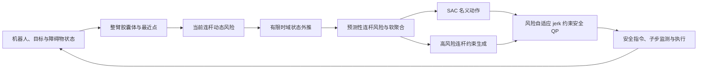

# 面向动态障碍物的机械臂预测性连杆风险建模与安全强化学习控制

> 文档状态：研究计划与论文写作大纲。文中“已有结果”来自当前已完成实验；“拟开展”内容须在实现和实验完成后才能写成结论。

## 目录

- [一、研究背景与意义](#一研究背景与意义)
- [二、研究目标](#二研究目标)
- [三、拟创新点与论文定位](#三拟创新点与论文定位)
- [四、研究范围与关键问题](#四研究范围与关键问题)
- [五、文献综述与总体技术路线](#五文献综述与总体技术路线)
- [六、主要研究内容](#六主要研究内容)
- [七、实验设计](#七实验设计)
- [八、论文章节安排](#八论文章节安排)
- [九、实施优先级与完成判据](#九实施优先级与完成判据)

## 一、研究背景与意义

随着机械臂逐渐进入人机协作、柔性制造和非结构化作业环境，其控制系统不仅需要完成目标到达任务，还需要对运动障碍物形成实时、整臂和具有提前量的安全响应。机械臂碰撞可能发生在上臂、肘部、前臂和腕部等任意部位，仅使用末端执行器距离或整臂单一最小距离，容易遗漏碰撞部位及局部运动趋势。

动态避障风险不仅由当前距离决定，还取决于障碍物和连杆的相对速度、运动方向及未来一段时间内的距离变化。一个当前距离较远但快速接近的障碍物，可能比一个距离较近但正在远离的障碍物更危险。因此，仅依据当前时刻的距离、接近速度或径向近似 TTC 进行反应式避障，仍可能出现预警不足和动作修正滞后的问题。

Soft Actor-Critic（SAC）适合机械臂关节速度连续控制，但单纯依靠奖励惩罚学习安全行为存在两方面局限：一是安全性依赖奖励权重和训练数据覆盖；二是策略在未见状态下仍可能输出危险动作。约束强化学习能够分离任务奖励与风险代价，但其安全效果仍受约束阈值、代价建模和训练稳定性影响，不能直接等同于部署阶段的动作安全保证。

基于以上问题，本文拟围绕“预测性连杆风险建模—风险驱动策略决策—安全与平滑统一指令整形—执行监测与验证”建立统一方法。首先，以胶囊体表示机械臂主要连杆，结合障碍物短时运动预测和机械臂状态外推，构造每根连杆的预测风险；其次，使用 SAC 生成兼顾目标到达与避障的名义关节速度；然后，通过风险自适应的 jerk 约束安全 QP，在最小幅度修正名义动作的同时统一满足逐连杆安全、关节限位、加速度和 jerk 约束；最后，对最终安全指令进行子步风险监测和异常降级。

本文与“强化学习 + 实时碰撞检测 + 轨迹融合”的一般视觉伺服框架保持明确区别：研究重点不是动态目标视觉跟踪，也不采用固定滤波与多项式轨迹融合作为执行主线，而是研究运动障碍物条件下机械臂全身不同连杆的短时风险预测，以及融合运动连续性约束的显式动作级安全修正。

## 二、研究目标

本文面向固定基座 UR5 机械臂在单动态球形障碍物环境下的静态目标位置到达任务，研究具有短时预测能力的整臂安全强化学习控制方法。主要目标如下：

1. 建立 UR5 主要连杆胶囊体模型，准确计算连杆—障碍物表面距离、最近点、相对接近速度和碰撞趋势。
2. 提出预测性连杆风险表征方法，通过有限时域状态外推获得未来最小间隙、首次越界时间和时域聚合风险，提升对非末端连杆危险的预警能力。
3. 提出风险自适应的关节加加速度（jerk）约束安全 QP 指令整形方法，在尽量保持 SAC 名义动作的同时，统一施加逐连杆预测安全约束、关节速度与位置约束、加速度约束和 jerk 约束。
4. 设计风险驱动的平滑权重调节机制：低风险时侧重抑制加速度和 jerk，高风险时在物理运动约束内提高避障响应优先级，并通过子步监测处理模型误差和异常状态。
5. 在 PyBullet 和低速真实 UR5 平台中，从任务、安全、提前预警、干预程度、平滑性和鲁棒性等方面验证各模块作用。

## 三、拟创新点与论文定位

### 3.1 核心创新点

1. **面向机械臂全身的预测性连杆风险表征方法。** 在已有连杆距离、相对方向、接近速度和径向近似 TTC 的基础上，引入障碍物与机械臂短时状态外推，计算各连杆在预测时域内的最小安全间隙、首次安全距离越界时间和时序加权风险。该方法保留风险发生部位，并由“当前反应式风险”扩展为“未来趋势风险”。

2. **风险自适应的 jerk 约束安全 QP 指令整形方法。** SAC 负责生成目标到达所需的名义关节速度；在线 QP 将名义动作跟踪、逐连杆预测安全约束、关节运动学约束以及加速度与 jerk 连续性统一求解，并依据预测风险调节连续性代价。该方法不再依赖安全层前后的固定滤波或轨迹插值，使最终执行动作同时具有明确的安全约束和运动连续性边界。

### 3.2 验证性贡献

3. **面向预测与干预机制的分层评价体系。** 构建随机穿越、重点连杆压迫、速度突变、观测噪声和预测误差等场景，除成功率和碰撞率外，引入首次预警提前量、安全层介入率、动作修正幅度、风险连杆识别率等指标，区分“是否感知到风险”“是否及时干预”和“是否完成任务”。该部分属于实验与评价贡献，不表述为独立算法创新。

### 3.3 非创新内容与结论边界

- SAC、凸 QP、距离变化率安全约束以及加速度和 jerk 限制均为已有基础方法；本文的创新主张限于它们与预测性逐连杆风险的耦合方式、风险自适应权重机制及统一在线指令整形框架。
- 固定风险惩罚 SAC 与约束 SAC 的比较属于前期研究和对比实验。已有结果未证明约束 SAC 整体优于经标定固定惩罚 SAC，因此约束 SAC 不再作为论文核心创新。
- 历史滤波系数自适应方案未获得稳定收益且增大 jerk，仅作为方法选择过程中的失败经验保留，不纳入正式控制管线。
- 在感知误差、离散控制、几何近似和软约束存在时，本文不宣称“绝对无碰撞”。安全层只能在所列模型假设和可行域条件下提供显式动作约束。

## 四、研究范围与关键问题

### 4.1 研究范围

| 类别 | 本文范围 | 不作为重点的内容 |
| --- | --- | --- |
| 机械臂 | 固定基座 UR5，主要连杆整臂避障 | 移动基座、自碰撞、末端姿态精确控制 |
| 任务 | 静态目标点到达 | 动态目标视觉伺服与复杂操作任务 |
| 障碍物 | 单个动态球形障碍物；低到中等速度 | 多障碍物、非规则物体、复杂遮挡 |
| 感知 | 仿真真值；实机 RGB-D 位置与速度估计 | 复杂目标检测和多传感器融合 |
| 控制 | SAC 名义策略、预测风险、jerk 约束安全 QP 指令整形 | 在线真实机器人强化学习 |
| 验证 | PyBullet 主验证，真实 UR5 低速部署验证 | 高速或接触式安全认证实验 |

多障碍物可作为附加泛化实验：对每个障碍物分别计算连杆风险和安全约束，再统一求解动作修正，但不扩展为论文主问题。

### 4.2 拟解决的关键问题

- **如何稳定表示整臂局部风险。** 最近连杆编号和硬最大风险可能在相邻连杆间跳变，需要在保留最危险部位信息的同时降低风险聚合不连续性。
- **如何获得有意义的短时预测。** 需要明确当前状态外推、候选动作外推和感知速度误差的适用边界，避免将匀速预测夸大为精确轨迹预测。
- **如何最小化安全干预对任务的影响。** 安全层既要阻止高风险动作，也要避免频繁介入导致机械臂停滞、绕行过度或动作震荡。
- **如何统一安全修正与动作平滑。** 独立的滤波或插值可能改变已经满足安全约束的动作，因此本文直接在安全 QP 中加入加速度、jerk 代价及其硬边界，使最终优化变量就是执行指令，并根据预测风险调节平滑代价与避障响应之间的权衡。
- **如何通过消融验证新增方法。** 实验必须分别验证预测风险和安全修正层，不能只比较完整方法与末端风险基线。

## 五、文献综述与总体技术路线

### 5.1 文献综述安排

文献综述围绕以下五条线索展开：

1. 机械臂动态避障：人工势场、采样规划、速度阻尼、MPC 和 CBF-QP 的实时性与安全边界。
2. 整臂几何建模：胶囊体、最近点距离、距离梯度和连杆雅可比。
3. 碰撞趋势预测：相对速度、TTC、有限时域最小距离和不确定性条件下的风险度量。
4. 强化学习机械臂控制：DDPG、TD3、SAC，以及奖励惩罚和约束强化学习的安全性局限。
5. 学习控制与安全指令整形：名义策略、安全盾、动作投影、jerk 约束和风险自适应控制之间的接口设计。

文献缺口拟归纳为：现有学习型机械臂避障常关注末端或当前最小距离；部分方法虽然加入实时碰撞检测，却没有显式建模不同连杆未来一段时间内的风险分布；仅依靠奖励学习也难以处理策略输出中的偶发危险动作。

| 常见做法 | 局限 | 本文拟改进 |
| --- | --- | --- |
| 末端风险或当前全局最小距离 | 易遗漏非末端风险及未来接近趋势 | 逐连杆有限时域风险预测 |
| `max_i Risk_i` 硬聚合 | 最危险连杆切换时可能不连续 | Softmax 聚合并保留 Top-k 风险信息 |
| 固定风险惩罚 SAC | 安全行为依赖权重和训练覆盖 | SAC 名义控制 + 部署期安全动作修正 |
| 仅在碰撞后给予惩罚 | 信号稀疏且缺少提前量 | 未来最小间隙和首次越界时间 |
| 安全修正与平滑串联 | 后级滤波或插值可能改变安全动作 | 在同一 QP 中统一安全、加速度与 jerk 约束 |

### 5.2 总体技术路线


```mermaid
flowchart LR
    A[机器人、目标与障碍物状态] --> B[整臂胶囊体与最近点]
    B --> C[当前连杆动态风险]
    C --> D[有限时域状态外推]
    D --> E[预测性连杆风险与软聚合]
    E --> F[SAC 名义动作]
    E --> H[高风险连杆约束生成]
    F --> I[风险自适应 jerk 约束安全 QP]
    H --> I
    I --> J[安全指令、子步监测与执行]
    J --> A
```

总体流程如下：

1. 获取关节状态、目标位置、障碍物位置与速度。
2. 计算各连杆胶囊体、最近点、表面距离和对应点速度。
3. 使用当前运动状态在有限时域内外推障碍物和机械臂，形成预测风险状态。
4. SAC 根据任务状态和连杆风险生成名义关节速度。
5. 使用 SAC 名义动作进行候选状态外推，并为 Top-k 高风险连杆构造预测安全约束。
6. 根据全身预测风险调节 QP 中的加速度与 jerk 代价权重，同时保留速度、加速度和 jerk 的物理硬边界。
7. 在线求解与名义动作最接近的安全关节速度，最终优化变量直接作为执行指令；若问题不可行，则通过松弛变量降级或触发停止。
8. 在物理子步持续监测最小距离、预测风险和感知状态，异常时限速或停止。

## 六、主要研究内容

### 6.1 机械臂整臂几何建模

第 `i` 个主要连杆采用胶囊体近似，球形障碍物由中心、速度和半径描述：

```text
L_i(q) = {p_i^a(q), p_i^b(q), r_i}
O_t = {c_t, v_t, R}
```

障碍物中心到连杆轴线的最近点和表面间隙为：

```text
u_i = p_i^b - p_i^a
rho_i = clip(((c - p_i^a)^T u_i) / (u_i^T u_i), 0, 1)
x_i = p_i^a + rho_i u_i
d_i = ||c - x_i|| - r_i - R
n_i = (c - x_i) / (||c - x_i|| + epsilon)
```

连杆对应点速度优先由雅可比计算：

```text
v_i^link = J_i(q, rho_i) q_dot
dot_d_i = n_i^T (v - v_i^link)
v_i^app = max(0, -dot_d_i)
```

有限差分实现必须固定当前投影系数 `rho_i`，避免将最近点沿连杆滑动误认为连杆自身速度。

### 6.2 当前连杆动态风险基线

当前时刻径向近似 TTC 定义为：

```text
if d_i <= d_safe:
    TTC_i = 0
elif v_i^app <= epsilon_v:
    TTC_i = TTC_max
else:
    TTC_i = min((d_i - d_safe) / v_i^app, TTC_max)
```

基线连杆风险为：

```text
R_d_i = clip(exp(-(d_i - d_safe) / sigma_d), 0, 1)
R_v_i = clip(v_i^app / v_max, 0, 1)
R_t_i = exp(-TTC_i / tau_ttc)
Risk_i^now = clip(w_d R_d_i + w_v R_v_i + w_t R_t_i, 0, 1)
```

该风险作为已有 `Instant-Link-SAC` 方法和后续预测风险消融的统一基线。

### 6.3 预测性连杆风险表征

设预测时域为 `H`，时间间隔为 `Delta t_p`。策略决策前使用当前关节速度和障碍物速度作短时外推：

```text
q_hat(k) = clip(q_t + k Delta t_p q_dot_t, q_min, q_max)
c_hat(k) = c_t + k Delta t_p v_t
k = 1, ..., H
```

该模型是局部匀速近似，只用于短时风险估计。对每个预测时刻重新计算表面间隙 `d_hat_i(k)`，定义：

```text
d_i^pred = min_k d_hat_i(k)
k_i^crit = argmin_k d_hat_i(k)
T_i^enter = min {k Delta t_p | d_hat_i(k) <= d_safe}
```

若预测时域内未进入安全边界，则令 `T_i^enter = T_pred_max`。预测风险分量为：

```text
R_pred_d_i = clip(exp(-(d_i^pred - d_safe) / sigma_pred), 0, 1)
R_enter_i = exp(-T_i^enter / tau_pred)
R_horizon_i = sum_k omega_k phi(d_hat_i(k)) / sum_k omega_k
omega_k = exp(-eta k Delta t_p)
```

最终预测性连杆风险定义为：

```text
Risk_i^pred = clip(
    w_now Risk_i^now
    + w_min R_pred_d_i
    + w_enter R_enter_i
    + w_h R_horizon_i,
    0, 1
)
```

各权重非负且和为 1。正式参数仅在训练/验证种子上选择，随后对所有对比方法固定。

### 6.4 全身风险聚合与风险部位编码

硬最大值 `max_i Risk_i` 作为基线。拟采用温度可控的 Softmax 加权聚合：

```text
z_i = w_i^link Risk_i^pred
alpha_i = exp(tau_s z_i) / sum_j exp(tau_s z_j)
Risk_body = sum_i alpha_i Risk_i^pred
```

若没有充分依据，连杆权重 `w_i^link` 统一取 1。该聚合值保持在各连杆风险值的范围内；`tau_s` 越大，其行为越接近硬最大值。策略状态同时输入全部连杆预测风险、全身软聚合风险、Top-1/Top-2 风险值及对应连杆编码、全身风险变化率。软聚合用于缓解最危险连杆切换导致的不连续，实验中与硬最大值消融比较。

### 6.5 SAC 名义策略

SAC 输出名义关节速度：

```text
a_t in [-1, 1]^6
q_dot_nom = q_dot_max * a_t
```

建议状态空间为：

```text
s_t = [
    q_t, q_dot_t, e_p_t,
    D_t, N_t, V_app_t, TTC_t,
    D_pred_t, T_enter_t, Risk_pred_body_t,
    Risk_body_t, topk_link_t,
    q_dot_cmd(t-1)
]
```

任务奖励保持简洁：

```text
r_task = -w_p ||p_ee - p_g||^2
r_progress = w_prog (||e_p(t-1)|| - ||e_p(t)||)
r_smooth = -w_c ||q_dot_cmd(t) - q_dot_cmd(t-1)||^2
r_success = R_s I[success]
r_t = r_task + r_progress + r_smooth + r_success
```

预测风险可以较小固定权重加入奖励，使名义策略主动绕行；部署安全不能只依赖该奖励项。核心方法优先基于当前表现最好的 `link_fixed_penalty1` 配置扩展，而不再将约束 SAC 设为主方法。

### 6.6 风险自适应 jerk 约束安全 QP 指令整形

安全指令整形器输入 SAC 名义速度 `q_dot_nom`、前两周期执行速度及预测性连杆风险，输出最终执行速度 `q_dot_cmd`。QP 原则上每个控制周期求解；只有当名义动作同时满足安全、关节运动学、加速度和 jerk 约束时，才可通过可行性检查直接透传。

对待求速度定义离散加速度和 jerk：

```text
a_k(q_dot) = [q_dot - q_dot_cmd(k-1)] / Delta t
j_k(q_dot) = [q_dot - 2 q_dot_cmd(k-1) + q_dot_cmd(k-2)] / Delta t^2
```

episode 初始化时令前两周期速度等于机器人实际初始速度，避免历史指令缺失导致虚假的 jerk 峰值。

在线优化问题为：

```text
min_(q_dot, xi)  ||q_dot - q_dot_nom||_W^2
                 + lambda_a(Risk_body) ||a_k(q_dot)||^2
                 + lambda_j(Risk_body) ||j_k(q_dot)||^2
                 + rho ||xi||^2
```

约束为：

```text
n_i^T (v_obst - J_i(q, rho_i) q_dot)
    + alpha [d_i(q, c) - d_safe] >= -xi_i

q_dot_min <= q_dot <= q_dot_max
q_min <= q + Delta t q_dot <= q_max

-a_max <= a_k(q_dot) <= a_max
-j_max <= j_k(q_dot) <= j_max

xi_i >= 0
```

第一项尽量保持 SAC 名义动作，第二、三项分别抑制加速度和 jerk，第四项惩罚安全约束松弛。速度、位置、加速度和 jerk 边界为正常运行时的硬约束；安全松弛变量仅用于避免数值不可行，其权重应显著高于连续性代价。只对 Top-k 高风险连杆或预警距离内的连杆建立安全约束，以降低实时计算量。在当前状态固定、最近点和雅可比按本周期线性化、各权重非负的条件下，该问题保持为凸 QP。

风险自适应权重采用有界单调函数，例如：

```text
lambda_a(R) = lambda_a_min
              + (lambda_a_max - lambda_a_min) (1 - R)^p_a
lambda_j(R) = lambda_j_min
              + (lambda_j_max - lambda_j_min) (1 - R)^p_j
R = clip(Risk_body, 0, 1)
```

低风险时使用较大的连续性权重以获得平稳动作；高风险时降低软惩罚，使优化器在物理加速度和 jerk 硬边界内优先满足安全约束。该机制只改变优化偏好，不放宽机器人本体运动极限。若安全松弛量超过许可阈值或 QP 求解失败，则退出正常指令整形并交由独立降级/急停逻辑处理；急停行为不纳入正常 jerk 连续性承诺。正式实验需比较固定权重与风险自适应权重，不能仅凭公式宣称其更优。

| 状态 | 条件 | 动作 |
| --- | --- | --- |
| 透传 | 名义动作满足全部安全与运动连续性约束 | 执行 `q_dot_nom` |
| 修正 | 任一约束活跃且优化可行 | 执行 `q_dot_cmd` |
| 降级 | 优化不可行、感知丢失或风险过高 | 限速保持或停止 |

指令整形器使用候选动作再次外推：

```text
q_hat_a(k) = clip(q_t + k Delta t_p q_dot_nom, q_min, q_max)
```

本文将上述连杆约束称为“基于距离变化率的动作级安全约束”，将完整优化器称为“风险自适应 jerk 约束安全 QP 指令整形器”。只有在连续控制、距离可微、状态准确和约束可行等假设得到说明时，才讨论其 CBF 含义；真实系统结论不表述为严格安全证明。

### 6.7 最终指令执行与子步监测

QP 输出是唯一的最终速度指令，不再附加可能改变安全动作的滤波或多项式过渡。执行顺序为：

```text
SAC 名义动作
-> 风险自适应 jerk 约束安全 QP
-> 最终速度指令
-> 子步风险监测与执行
```

在一个策略周期内，速度指令由底层速度伺服器按固定物理步长执行；加速度和 jerk 的跨周期连续性由 QP 显式约束。若子步期间预测最小间隙低于停止阈值，应中止当前指令并进入降级状态。训练、测试和真实部署必须使用一致的指令整形与监测管线。

### 6.8 训练与部署流程

训练分为两个阶段：

1. **名义策略训练。** 使用预测性连杆风险状态和固定风险惩罚训练 SAC，QP 指令整形器关闭或仅记录，避免策略完全依赖外部修正。
2. **指令整形器联合评估。** 固定策略参数并启用安全 QP 指令整形器。如进行少量整形器在环重训，必须与“仅测试时外挂整形器”分开报告。

部署阶段不进行在线强化学习更新。每个控制周期记录名义动作、安全动作、介入原因、活跃连杆、优化状态、风险和最终执行动作，以支持可解释性和失败分析。

## 七、实验设计

### 7.1 实验平台与公平性设置

| 配置项 | 内容 |
| --- | --- |
| 仿真平台 | PyBullet |
| 机械臂 | UR5，固定基座 |
| 控制方式 | 6 维关节速度 |
| 任务 | 静态目标位置到达 |
| 主障碍物 | 单个动态球体 |
| 策略/物理频率 | 20 或 30 Hz / 240 Hz |
| 训练随机种子 | 每种主方法至少 3 个 |
| 测试随机种子 | 与训练和调参集合分离 |

所有主方法保持相同机械臂模型、动作范围、任务分布、训练步数、网络容量、执行器配置和测试 episode。参数筛选仅使用训练/验证种子，最终测试种子不得参与方法选择。

### 7.2 主比较与消融矩阵

| 方法 | 风险信息 | 名义策略安全处理 | 执行期指令整形 | 目的 |
| --- | --- | --- | --- | --- |
| `EE-SAC` | 末端当前风险 | 固定惩罚 | 无 | 末端风险基线 |
| `Instant-Link-SAC` | 当前连杆风险 | 固定惩罚 | 无 | 已有连杆级基线 |
| `Predictive-Link-SAC` | 预测性连杆风险 | 固定惩罚 | 无 | 验证预测风险作用 |
| `Proposed` | 预测性连杆风险 | 固定惩罚 | 风险自适应 jerk 约束安全 QP | 验证完整方法 |
| `Instant-Link-SAC+QP` | 当前连杆风险 | 固定惩罚 | 相同安全 QP 指令整形 | 区分预测与安全层作用 |
| `LDRC-SAC`（次要） | 当前连杆风险 | 约束 SAC | 无 | 保留已有安全处理比较 |

最低限度必须完成前四种方法。`Instant-Link-SAC+QP` 用于关键交叉消融，资源允许时优先加入；`LDRC-SAC` 使用已有结果作为补充，不再消耗主要篇幅证明其优越性。

### 7.3 已有结果与其用途

现有 held-out 实验已经证明“连杆级当前风险”值得作为新方法起点，但不能用于证明尚未实现的预测风险或安全 QP 指令整形器。

**Random Crossing 已有结果（3 个 train seeds，每种方法共 900 episodes）**

| 方法 | success rate | collision rate | final position error | min distance | safety violation rate | RMS jerk |
| --- | ---: | ---: | ---: | ---: | ---: | ---: |
| `ee_fixed` | 17.00% +/- 2.00% | 13.44% +/- 5.19% | 0.369 +/- 0.017 m | 0.177 +/- 0.012 m | 2.38% +/- 1.44% | 25.0 +/- 2.0 |
| `link_fixed_penalty1` | 64.22% +/- 12.54% | 6.89% +/- 2.22% | 0.125 +/- 0.029 m | 0.193 +/- 0.020 m | 1.27% +/- 0.92% | 32.3 +/- 2.7 |
| `ldrc_fixed` | 56.33% +/- 18.02% | 5.56% +/- 2.91% | 0.172 +/- 0.054 m | 0.167 +/- 0.008 m | 3.12% +/- 1.27% | 32.7 +/- 0.2 |

已有结果支持：

- 当前连杆级风险相较末端风险显著改善目标到达表现，并降低随机穿越场景中的碰撞率。
- 经标定固定惩罚在成功率、最终误差、最小距离和安全距离违反率方面优于当前约束 SAC。
- 约束 SAC 仅在部分场景具有略低碰撞率，不能表述为整体最优。

已有结果尚不支持：

- 预测性风险比当前风险具有更长预警时间或更低碰撞率；
- 安全 QP 指令整形器能够降低碰撞且不显著损害任务性能；
- 完整方法具有形式化安全保证。

原 upper arm、elbow、forearm、wrist 压力测试详细表继续作为当前连杆风险基线材料保存，最终正文可压缩为一张分区域图，完整数值放入附录。

### 7.4 评价指标

| 类别 | 指标 | 作用 |
| --- | --- | --- |
| 任务性能 | Success Rate、Final Position Error、Completion Time | 衡量到达能力与效率 |
| 结果安全 | Collision Rate、Non-End-Link Collision Rate、Minimum Distance、Safety Violation Rate | 衡量最终安全结果 |
| 预测能力 | Warning Lead Time、未来最小距离误差、风险连杆识别率 | 衡量是否提前且正确发现危险 |
| 干预行为 | Intervention Rate、Intervention Duration、Action Correction Norm、Constraint Active Rate、QP Infeasible Rate | 衡量指令整形器是否克制和实时 |
| 平滑性 | RMS/Peak Joint Acceleration、RMS/Peak Jerk、Action Variation、Motion-Limit Violation Rate | 衡量执行连续性与硬边界满足情况 |
| 实时性 | Policy Inference Time、Risk Prediction Time、QP Solve Time、Cycle Overrun Rate | 衡量部署可行性 |

首次预警提前量定义为：

```text
LeadTime = t_first_violation_or_collision - t_first_warning
```

若 episode 未发生越界，可根据障碍物轨迹的反事实最近时刻或预设穿越时刻统计，必须在论文中统一口径。动作修正幅度定义为：

```text
CorrectionNorm = ||q_dot_cmd - q_dot_nom||_2
```

仅报告低碰撞率不足以证明指令整形器有效，还需同时报告介入率和修正幅度，避免方法通过长时间停止获得表面安全。

### 7.5 核心实验一：预测风险有效性

对比 `Instant-Link-SAC` 与 `Predictive-Link-SAC`，并在相同策略动作或离线轨迹上独立比较风险估计器。

场景包括：

- 障碍物以不同速度侧向穿越上臂、肘部、前臂和腕部；
- 当前距离相同但接近速度不同；
- 当前距离较近但正在远离；
- 障碍物发生一次速度突变。

主要回答：预测风险能否增加预警提前量，是否减少对“近但远离”障碍物的误报，以及最危险连杆识别是否正确。

### 7.6 核心实验二：安全 QP 指令整形有效性

对比 `Predictive-Link-SAC` 与 `Proposed`，必要时加入 `Instant-Link-SAC+QP`。除任务和碰撞指标外，重点报告：

- 指令整形器介入次数与持续时间；
- 每次介入的活跃连杆和动作修正幅度；
- 加速度、jerk 的均方根值、峰值及运动约束活跃率；
- QP 求解时间、不可行率和停止次数；
- 启用指令整形器后成功率或完成时间的变化。

该实验的理想结论不是“指令整形器从不介入”，而是“在少量高风险时刻进行有限修正，显著降低碰撞与安全距离违反，同时保持可接受的任务完成能力”。

### 7.7 核心实验三：风险聚合与预测时域消融

| 消融因素 | 候选设置 |
| --- | --- |
| 预测时域 `H Delta t_p` | 短、中、长三个时域 |
| 预测特征 | 当前风险；未来最小距离；首次越界时间；完整组合 |
| 全身聚合 | hard max；Softmax 加权聚合 |
| 活跃约束数量 | Top-1；Top-2；所有预警连杆 |
| 加速度与 jerk 机制 | 无连续性项；仅软代价；软代价 + 硬边界 |
| 连续性权重 | 固定权重；风险自适应权重 |

分析安全性、任务效率、误报、jerk 和计算开销之间的变化。参数选择应基于验证集综合指标，不在最终测试集上反复选择。

### 7.8 鲁棒性与泛化实验

鲁棒性实验优先覆盖现实中最可能破坏预测模型的因素：

| 因素 | 设置 |
| --- | --- |
| 位置噪声 | 对障碍物位置加入分级高斯噪声 |
| 速度误差 | 速度缩放、方向扰动和估计延迟 |
| 运动突变 | 障碍物中途改变速度或方向 |
| 控制延迟 | 增加 1 至若干控制周期延迟 |
| 未见速度 | 测试速度范围略超出训练分布 |

多障碍物只作为附加泛化：使用两个球形障碍物验证风险计算和 QP 约束能否自然扩展，不以此作为主要创新结论。

### 7.9 安全与平滑统一指令整形消融

在相同 actor 和测试轨迹下比较以下执行器配置：原始 SAC 动作、仅最小干预安全 QP、加入加速度约束的安全 QP、加入加速度与 jerk 约束的安全 QP，以及完整的风险自适应权重安全 QP。重点分析安全约束、连续性约束和风险自适应机制各自对碰撞率、成功率、动作修正幅度、峰值 jerk 与求解时间的影响。

为保证公平，主结论使用训练与测试执行器一致的 checkpoint；同 actor 反事实比较仅用于定位各约束的即时作用。历史滤波系数自适应结果只用于说明方案选择过程，不与本文的风险自适应 QP 权重机制混为一谈：前者改变滤波动态，后者在固定物理硬边界内改变凸优化代价。

### 7.10 真实 UR5 低速验证

真实实验使用单台 RGB-D 相机检测轻质球形障碍物，位置经外参转换到机器人基坐标系，速度由连续帧差分和低通滤波估计。机械臂采用限速、工作空间限制、感知丢失停止和人工急停。

建议至少完成以下两组，每组 10 至 20 次：

1. `Predictive-Link-SAC`：仅名义策略，不启用安全层。
2. `Proposed`：相同策略启用风险自适应 jerk 约束安全 QP 指令整形器。

真实实验不故意制造接触，使用安全距离违反、最小距离、介入率、动作修正幅度、任务成功率和执行稳定性进行比较。展示平台照片、关键帧序列、`d_min`、预测风险、活跃连杆、名义/修正速度和求解耗时曲线。

真实实验只支持低速部署可行性和基本风险响应结论，不替代受控仿真消融，也不作为绝对安全证明。

### 7.11 失败案例与适用边界

| 失败场景 | 可能原因 | 应记录信息 |
| --- | --- | --- |
| 障碍物速度过快 | 机械臂速度与预测提前量不足 | `d_pred`、LeadTime、速度限幅、停止时刻 |
| 障碍物突然转向 | 匀速模型失配 | 速度估计、预测误差、风险变化率 |
| 目标与避障方向冲突 | 安全约束压缩可行动作空间 | QP 活跃约束、松弛量、最终误差 |
| QP 频繁介入 | 风险阈值过低或名义策略依赖安全层 | Intervention Rate、CorrectionNorm |
| QP 不可行 | 多约束冲突或已进入危险区域 | 松弛量、最小距离、降级状态 |
| 最近点/连杆切换 | 几何近似引起风险不连续 | 最近点、Top-k 连杆、hard/soft 聚合结果 |
| 感知丢失或延迟 | 真实观测不可用 | 检测状态、时间戳、停止延迟 |

本文结论限定为：在主要连杆几何模型可用、动态球形障碍物状态可观测、控制频率和关节运动受限的条件下，预测性连杆风险与风险自适应安全 QP 指令整形能否改善机械臂静态目标到达过程中的提前预警、整臂避障和平滑执行表现。

## 八、论文章节安排

### 第一章 绪论

介绍研究背景、国内外现状、问题定义、研究内容、创新点和论文结构，明确与安全视觉伺服及一般实时碰撞检测框架的区别。

### 第二章 理论基础与系统建模

介绍 UR5 运动学、胶囊体距离、连杆对应点速度、SAC、距离变化率安全约束、离散加速度与 jerk 约束及凸 QP，为后续方法建立统一符号。

### 第三章 预测性连杆动态风险建模

给出当前风险基线、有限时域外推、未来最小距离、首次越界时间、时序风险聚合和全身软聚合方法，并分析计算复杂度和模型假设。

### 第四章 预测风险驱动的安全强化学习控制

给出 SAC 状态、动作与奖励，重点阐述风险自适应权重、jerk 约束安全 QP、不可行降级和子步监测的完整控制流程。

### 第五章 仿真实验与分析

依次报告已有当前连杆风险基线、预测风险有效性、安全 QP 指令整形有效性、交叉消融、参数敏感性、鲁棒性、实时性和失败案例。

### 第六章 真实机械臂部署验证

介绍 RGB-D 感知、坐标标定、控制接口、安全措施和低速实机结果，强调实验边界。

### 第七章 总结与展望

总结预测风险与安全 QP 指令整形的实验结论，讨论匀速预测、单障碍物、感知误差和软约束局限，展望多障碍物、不确定性预测和更严格的安全验证。

## 九、实施优先级与完成判据

为避免范围失控，后续工作按以下顺序开展：

1. 实现并单元测试有限时域连杆距离预测，先用已记录轨迹验证预警提前量。
2. 在固定已有 actor 的条件下实现风险自适应 jerk 约束安全 QP，验证安全约束方向、速度/位置/加速度/jerk 限位、松弛和降级逻辑。
3. 完成 `Instant-Link-SAC`、`Predictive-Link-SAC` 和 `Proposed` 三者的同场景消融。
4. 根据验证集确定预测时域、安全阈值、连续性权重范围及风险映射参数，再运行独立 held-out seeds。
5. 完成噪声、延迟和速度突变鲁棒性实验。
6. 在仿真结果稳定后开展真实 UR5 低速验证。

论文核心方法达到可写结论的最低判据为：

- 预测风险相较当前风险具有可重复的正预警提前量，并保持可接受的误报率；
- 完整方法相较无安全 QP 指令整形的方法降低碰撞率或安全距离违反率，且成功率没有不可接受下降；
- 完整方法相较无连续性约束的安全 QP 降低 RMS/Peak jerk，且不显著削弱高风险时的避障响应；
- QP 指令整形求解耗时满足控制周期要求，不可行率和长期停止率可解释；
- 至少 3 个训练随机种子和独立测试种子得到方向一致的结果；
- 所有创新结论均有对应消融，未完成模块不写成既成贡献。
